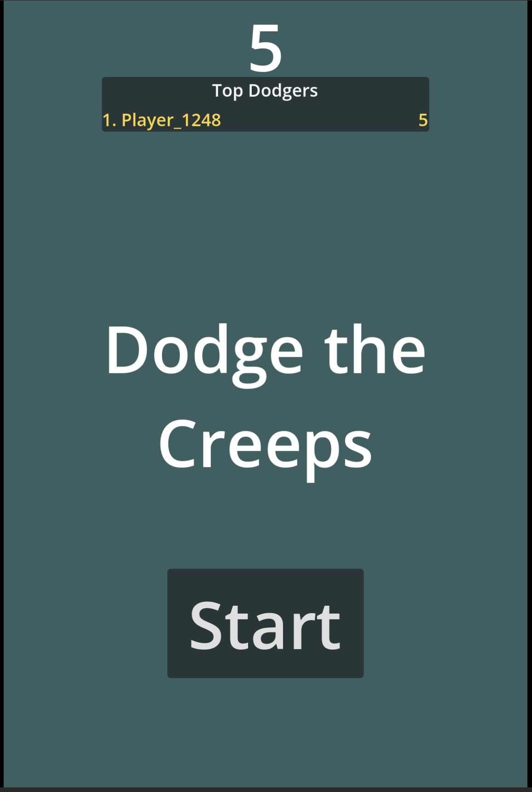
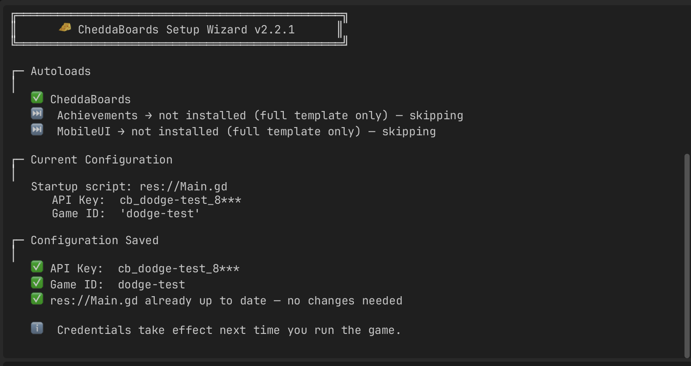
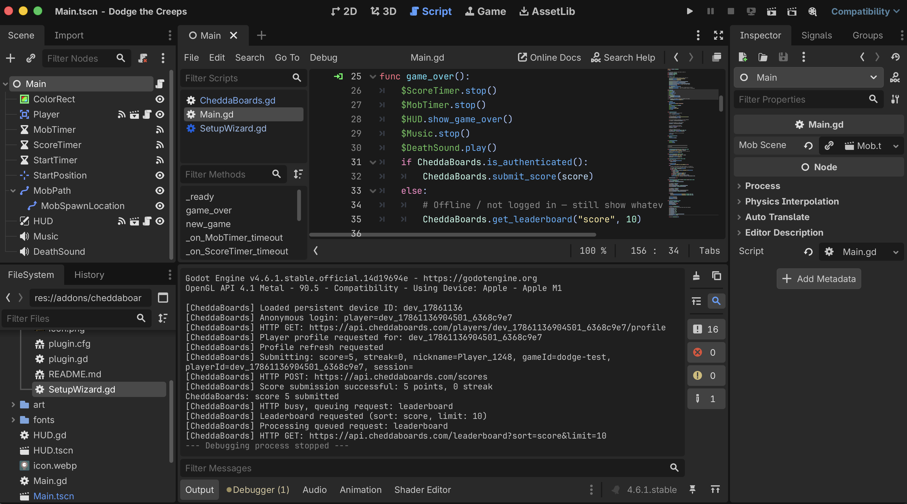

<p align="center">
  
</p>

<h1 align="center">Dodge the Creeps × CheddaBoards</h1>

<p align="center">
  The official Godot demo game with a real online leaderboard — added in ~60 lines, nothing to host.<br>
  <a href="https://cheddaboards.com">cheddaboards.com</a> ·
  <a href="https://github.com/cheddatech/CheddaBoards-Godot">SDK &amp; docs</a> ·
  <a href="https://store.godotengine.org/asset/cheddatech/cheddaboards">Godot Asset Store</a>
</p>

<p align="center">
  
</p>

Every Godot developer has built [Dodge the Creeps](https://docs.godotengine.org/en/stable/getting_started/first_2d_game/index.html). It's the official "your first 2D game" tutorial: dodge the mobs, watch your score tick up, die, restart. What it doesn't have is any reason to play twice.

This repo fixes that. The game submits every run to an online leaderboard and shows the top 10 at game over — with your own entry highlighted in gold. All the changes live in one file (`Main.gd`), and there's no backend to build: no server, no database, no per-player fees.

**Two ways to use this repo:**

- **Clone and run it.** Open the project in Godot 4.6+, add your own free API key (Step 2 below), play. The addon is included.
- **Read it as a tutorial.** The walkthrough below is the full integration, gotchas included. The commit history is deliberate: the first commit is vanilla Dodge the Creeps, the second is the integration — so `git diff` shows you *exactly* what an integration touches. It isn't much.

---

## Step 1 — Install the CheddaBoards addon

*(Already done in this repo — this is what you'd do in your own game.)*

Get the addon from the [Godot Asset Store](https://store.godotengine.org/asset/cheddatech/cheddaboards) or the [SDK repo](https://github.com/cheddatech/CheddaBoards-Godot). You'll end up with an `addons/cheddaboards/` folder in your project root:

```
your-project/
├── addons/
│   └── cheddaboards/
│       ├── CheddaBoards.gd
│       ├── SetupWizard.gd
│       ├── plugin.cfg
│       └── ...
├── Main.tscn
├── Main.gd
└── ...
```

Then enable it: **Project → Project Settings → Plugins**, tick **CheddaBoards**. Enabling the plugin automatically registers the `CheddaBoards` autoload — that singleton is how your scripts talk to the service.

Run the game once before changing anything. It should play exactly as before; the addon sits quietly until you call it.

## Step 2 — Get your API key

Head to the [CheddaBoards dashboard](https://cheddaboards.com), create a game (this project expects one called `dodge-test`, but any name works), and copy its API key:

```
cb_your-game_xxxxxxxxxx
```

The middle section is your game ID — the SDK extracts it automatically, so the key is the only thing you copy.

## Step 3 — Run the Setup Wizard

Open `addons/cheddaboards/SetupWizard.gd` in the script editor and run it with **File → Run** (Ctrl/Cmd+Shift+X).

<p align="center">
  
</p>

The wizard checks the autoload, then asks for your API key. It shows the game ID it detected and — importantly — which script it's about to write to. In Dodge the Creeps that's `Main.gd`, the root script of the main scene. Hit Save and it inserts a marked block at the top of `_ready()`:

```gdscript
	# --- CheddaBoards credentials (managed by Setup Wizard) ---
	CheddaBoards.set_api_key("cb_your-game_xxxxxxxxxx")
	CheddaBoards.set_game_id("your-game")
	# --- end CheddaBoards credentials ---
```

Re-run the wizard any time (say, to swap keys) — it replaces the block in place rather than duplicating it.

> **Gotcha #1: check your Inspector exports after the wizard runs.**
> The wizard edits `Main.gd` on disk while the editor has it open, and Godot's script hot-reload can occasionally reset exported property values on open scenes. In Dodge the Creeps that's the **Mob Scene** slot on the Main node — if your next run crashes with *"Cannot call method 'instantiate' on a null value"*, select the Main node and re-assign `mob.tscn` to the empty Mob Scene property. Thirty-second fix, and it only happens once.

## Step 4 — Log in and submit scores

Dodge the Creeps keeps everything we need in `Main.gd`: the `score` variable and a `game_over()` function that runs when you die. We log in once at startup, then submit on every game over.

In `_ready()`, after the wizard's credentials block:

```gdscript
	CheddaBoards.score_submitted.connect(_on_cb_score_submitted)
	CheddaBoards.score_error.connect(_on_cb_score_error)
	CheddaBoards.leaderboard_loaded.connect(_on_cb_leaderboard_loaded)
	CheddaBoards.debug_logging = true  # dev only — remove before shipping
	_build_leaderboard_panel()
	await CheddaBoards.wait_until_ready()
	CheddaBoards.login_anonymous()
	CheddaBoards.refresh_profile()
```

Two things worth understanding:

**Anonymous login needs no sign-up.** `login_anonymous()` identifies the player by a persistent device ID the SDK generates and stores in `user://` — the same player keeps the same identity across sessions without typing anything. If they don't choose a name, the server assigns one automatically (this project's test player came back as `Player_1248`). Want players to pick? `login_anonymous("Chedz")` — that's the whole upgrade.

**`refresh_profile()` fetches the player's server-side profile**, including that auto-assigned nickname. We use it later to spot the player's own row on the board.

Then in `game_over()`:

```gdscript
func game_over():
	$ScoreTimer.stop()
	$MobTimer.stop()
	$HUD.show_game_over()
	$Music.stop()
	$DeathSound.play()
	if CheddaBoards.is_authenticated():
		CheddaBoards.submit_score(score)
	else:
		CheddaBoards.get_leaderboard("score", 10)
```

Logged in → submit. Login failed somehow → skip straight to fetching, so the player still sees a board.

## Step 5 — Fetch the board at the right moment

Here's the pattern that trips people up. Don't submit and fetch at the same time — the fetch can win the race, and the player stares at a board that doesn't include the run they just finished.

Fetch **in response to the submit confirmation** instead. The SDK emits `score_submitted` when the server has accepted the score:

```gdscript
func _on_cb_score_submitted(submitted: int, _streak: int) -> void:
	CheddaBoards.get_leaderboard("score", 10)

func _on_cb_score_error(reason: String) -> void:
	push_warning("CheddaBoards submit failed: " + reason)
	# Submit failed — show the board anyway.
	CheddaBoards.get_leaderboard("score", 10)
```

Submit → confirmed → fetch → display. Your new score is always on the board you're looking at.

## Step 6 — Display it

The addon deliberately ships no UI — your game's look is your business. For Dodge the Creeps we build a small panel in code: a `CanvasLayer` holding a `PanelContainer`, one row per entry. The full code is in [`Main.gd`](Main.gd) (functions `_build_leaderboard_panel`, `_on_cb_leaderboard_loaded`, `_add_board_row`, `_hide_leaderboard`) — the interesting parts:

Entries come back as dictionaries — `{ rank, nickname, score, streak }` — with the rank already computed server-side:

```gdscript
func _on_cb_leaderboard_loaded(entries: Array) -> void:
	for child in _board_rows.get_children():
		child.queue_free()

	if entries.is_empty():
		_add_board_row("No scores yet — be the first!", "", false)
	else:
		var my_nick: String = CheddaBoards.get_nickname()
		for entry in entries:
			var nickname: String = str(entry.get("nickname", "")).strip_edges()
			if nickname.is_empty():
				nickname = "Guest"
			var entry_score := int(entry.get("score", 0))
			var entry_rank := int(entry.get("rank", 0))
			var is_me: bool = my_nick != "" and nickname == my_nick
			_add_board_row("%d. %s" % [entry_rank, nickname], str(entry_score), is_me)

	_board_layer.visible = true
```

The gold highlight compares each entry's nickname to your own — which is why Step 4 called `refresh_profile()`: without it, the SDK doesn't know the server named you `Player_1248`, and nothing lights up.

The board hides again when a new run starts — first line of `new_game()` calls `_hide_leaderboard()`.

> **Gotcha #2: `mouse_filter = MOUSE_FILTER_IGNORE` on every panel node.**
> Dodge the Creeps restarts via the HUD's Start button. An invisible Control sitting over it will silently eat the click and the game will feel broken. Every node in the leaderboard panel ignores mouse input, so clicks pass straight through to the HUD underneath.

## Step 7 — Die gloriously

Run the game. Dodge badly. When you hit a creep, watch the Output panel:

<p align="center">
  
</p>

```
[CheddaBoards] Submitting: score=5, streak=0, nickname=Player_1248, gameId=dodge-test, ...
[CheddaBoards] Score submission successful: 5 points, 0 streak
[CheddaBoards] Leaderboard requested (sort: score, limit: 10)
```

…and the panel appears with your name in gold. Check your dashboard — the score is there too. That's a complete online leaderboard: persistent identity, score submission, live top-10, in about 60 added lines and one modified file.

---

## Where to go from here

- **Let players name themselves** — `login_anonymous("TheirName")`, or wire up a `LineEdit` before login. Anonymous players can also upgrade to a full account later without losing their scores.
- **Daily and weekly boards** — `get_daily_leaderboard()` and `get_weekly_leaderboard()` work exactly like the fetch above, with automatic resets at calendar boundaries. Instant "come back tomorrow" energy for an arcade game.
- **Harden against cheaters** — for anything competitive, look at play sessions in the [docs](https://github.com/cheddatech/CheddaBoards-Godot/tree/main/docs): the server validates that scores came from a plausible play session rather than a hand-crafted HTTP request.
- **A note on API keys** — the key ends up inside your shipped game, so treat it as identifying, not secret. Anyone can find it, which is exactly why score submission runs through CheddaBoards' rate-limited validation layer rather than trusting the client. Play sessions (above) tighten this further.

## Licenses & attribution

- Integration code and the CheddaBoards SDK: **MIT** © CheddaTech Ltd — see [LICENSE](LICENSE).
- Dodge the Creeps is from the official [Godot demo projects](https://github.com/godotengine/godot-demo-projects) (**MIT** © Godot Engine contributors); art and audio assets carry their original licenses — see [THIRD_PARTY.md](THIRD_PARTY.md).

Built and maintained by a solo dev - if you ship something with a board in it, [tell me](https://cheddaboards.com). I want to lose to strangers in your game.
